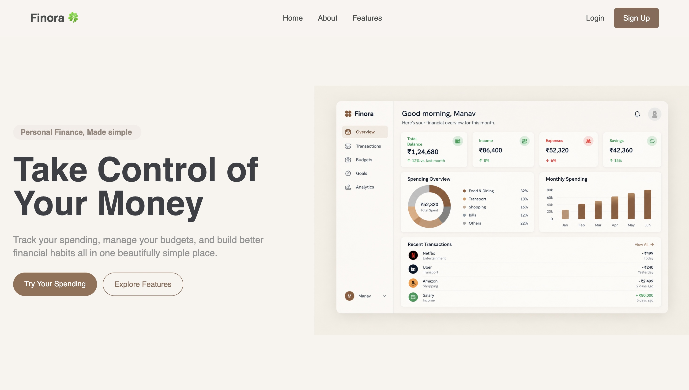

# Finora 🍀

Finora is a modern personal finance dashboard built with React, Vite, and Tailwind CSS.

I built Finora as a frontend project to practice building a real-world fintech application. It helps users track spending, manage budgets, set savings goals, and understand their finances through charts and visual data.

> 🚀 Status: Deployed

**Live Demo:** https://finora-zeta-three.vercel.app/

## 📸 Preview

## ✨ Features

- Responsive landing page
- Login & signup UI
- Finance dashboard
- Transaction management
- Budget tracking
- Savings goals
- Income & expense analytics
- Recurring payments
- Financial calendar
- Reports
- Financial insights
- Profile & settings
- LocalStorage data persistence
- Responsive design

## 🛠️ Tech Stack

- React
- Vite
- JavaScript
- Tailwind CSS
- React Router
- Recharts
- Remix Icons
- LocalStorage

## 🚀 Getting Started

Clone the project:

git clone https://github.com/manavraidewans-lgtm/Finora.git
cd Finora
npm install
npm run dev

## 📊 About

Finora currently uses local/mock data, so there is no backend or real authentication yet.

I'm building it step by step with the goal of eventually adding a backend, real authentication, and persistent user accounts.

## 👨‍💻 Author

Manav Dewan -- Frontend Developer
